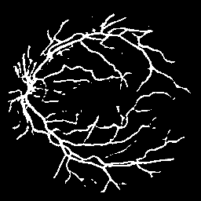

# 👁️ Retina Blood Vessel Segmentation

### Deep Learning • Medical Image Segmentation • Computer Vision • PyTorch

<p align="center">
  <strong>Automated retinal blood-vessel segmentation using U-Net with a ResNet34 encoder</strong>
</p>

<p align="center">
  
  
  
  
  
</p>

<p align="center">
  
  
  
  
</p>

---

## 🧠 Project Overview

This project implements an **end-to-end deep learning pipeline for retinal blood-vessel segmentation** from fundus photographs.

The goal is to automatically identify retinal blood vessels at the **pixel level** and generate a binary segmentation mask.

The final model combines:

> **U-Net + ImageNet-pretrained ResNet34 + Tversky Loss + Binary Cross-Entropy**

The model was trained and evaluated using the **DRIVE retinal vessel segmentation dataset**.

---

## 🏆 Final Performance

| Metric                     |                  Result |
| :------------------------- | ----------------------: |
| 🥇 **Dice Score**          |              **0.7113** |
| 🎯 **IoU**                 |              **0.5523** |
| 🔧 **Inference Threshold** |                 **0.6** |
| 🧠 **Architecture**        |    **U-Net + ResNet34** |
| ⚡ **Encoder**              | **ImageNet pretrained** |
| 📚 **Loss Function**       |       **Tversky + BCE** |
| 🔁 **Training**            |           **35 epochs** |

### 📌 What do these metrics mean?

**Dice Score** measures the overlap between the predicted vessel mask and the ground-truth mask.

**IoU (Intersection over Union)** measures the intersection between prediction and ground truth relative to their union.

Both metrics are commonly used to evaluate pixel-level image segmentation.

---

## 🖼️ Example Prediction

<p align="center">
  
</p>

<p align="center">
  <em>Example retinal vessel segmentation generated by the trained model.</em>
</p>

---

# 🏗️ Model Architecture

```text
                 RETINAL FUNDUS IMAGE
                         │
                         ▼
              ┌─────────────────────┐
              │    PREPROCESSING    │
              │ Resize + Normalize  │
              └──────────┬──────────┘
                         │
                         ▼
              ┌─────────────────────┐
              │       U-NET         │
              │                     │
              │  ResNet34 Encoder   │
              │  ImageNet Weights   │
              │         │           │
              │         ▼           │
              │  Feature Extraction │
              │         │           │
              │         ▼           │
              │ Decoder + Skip      │
              │ Connections         │
              └──────────┬──────────┘
                         │
                         ▼
                Pixel-wise Logits
                         │
                         ▼
                 Sigmoid Activation
                         │
                         ▼
                  Threshold = 0.6
                         │
                         ▼
               RETINAL VESSEL MASK
```

---

# 🔬 Experimentation

The final model was selected after testing multiple training strategies, loss functions, and model configurations.

| Experiment                      |  Test Dice |   Test IoU |
| :------------------------------ | ---------: | ---------: |
| Baseline U-Net + Dice/BCE       |     0.6511 |     0.4836 |
| Augmented Training              |     0.5854 |     0.4143 |
| Patch-Based Training            |     0.6464 |     0.4782 |
| Focal + Dice                    |     0.6351 |     0.4665 |
| ImageNet-pretrained ResNet34    |     0.6976 |     0.5361 |
| 🏆 **Tversky + BCE + ResNet34** | **0.7113** | **0.5523** |

### 🔎 What improved performance?

#### 1. Transfer Learning

Using an ImageNet-pretrained **ResNet34 encoder** improved feature extraction compared with training the encoder from scratch.

#### 2. Tversky + BCE Loss

The final loss combined **Tversky Loss** with **Binary Cross-Entropy**, providing a strong objective for the highly imbalanced vessel/background segmentation problem.

---

# 🎯 Threshold Optimization

The model outputs pixel-level probabilities. Multiple thresholds were evaluated before selecting the final inference threshold.

| Threshold |       Dice |        IoU |
| :-------: | ---------: | ---------: |
|    0.3    |     0.6727 |     0.5075 |
|    0.4    |     0.6950 |     0.5331 |
|    0.5    |     0.7075 |     0.5479 |
| ⭐ **0.6** | **0.7113** | **0.5523** |
|    0.7    |     0.7076 |     0.5479 |

**0.6 produced the best Dice and IoU among the evaluated thresholds.**

This threshold is therefore used by the inference script.

---

# 🧪 Training Pipeline

```text
                 DRIVE DATASET
                      │
                      ▼
          Fundus Images + Vessel Masks
                      │
                      ▼
               Preprocessing
                      │
             ┌────────┴────────┐
             ▼                 ▼
        Resize 256×256     Normalize [0,1]
             │                 │
             └────────┬────────┘
                      ▼
             U-Net + ResNet34
                      │
                      ▼
             Tversky Loss + BCE
                      │
                      ▼
                Adam Optimizer
                      │
                      ▼
                  35 Epochs
                      │
                      ▼
             Sigmoid Prediction
                      │
                      ▼
            Threshold Optimization
                      │
                      ▼
              Dice + IoU Evaluation
```

---

# 📊 Dataset

This project uses the **DRIVE (Digital Retinal Images for Vessel Extraction)** dataset.

The dataset contains retinal fundus photographs together with manually annotated vessel masks.

### Dataset structure

```text
DRIVE/
│
├── training/
│   ├── images/
│   ├── 1st_manual/
│   └── mask/
│
└── test/
    ├── images/
    └── 1st_manual/
```

The dataset itself is **not included in this repository**.

---

# 🛠️ Tech Stack

### 🧠 Machine Learning

* PyTorch
* Segmentation Models PyTorch
* U-Net
* ResNet34
* Transfer Learning
* Tversky Loss
* Binary Cross-Entropy
* Adam Optimizer

### 👁️ Computer Vision

* OpenCV
* Pillow
* NumPy

### 💻 Development

* Python 3.11
* Jupyter Notebook
* VS Code
* Git
* GitHub

---

# 📁 Project Structure

```text
retina-blood-vessel-segmentation/
│
├── 📂 assets/
│   └── 🖼️ prediction_01.png
│
├── 📂 data/
│   └── 📂 raw/
│       └── 📂 DRIVE/
│
├── 📂 notebooks/
│   └── 📓 EDA_and_training.ipynb
│
├── 📂 src/
│   ├── 🐍 train.py
│   └── 🐍 predict.py
│
├── 📂 models/
│   └── trained model checkpoints
│
├── 📄 README.md
├── 📄 requirements.txt
└── 📄 .gitignore
```

> Dataset files, virtual environments, trained checkpoints, and generated prediction files are excluded from version control where appropriate.

---

# 🚀 Run Inference

The repository includes a reusable Python inference script.

### 1️⃣ Activate the virtual environment

Windows PowerShell:

```powershell
.\.venv\Scripts\Activate.ps1
```

### 2️⃣ Run prediction

```powershell
python src\predict.py <input_image> <output_image>
```

### Example

```powershell
python src\predict.py data\raw\DRIVE\test\images\01_test.tif prediction_01.png
```

The inference pipeline:

```text
Input Retinal Image
        │
        ▼
Image Loading
        │
        ▼
Resize → 256×256
        │
        ▼
Normalization
        │
        ▼
Trained U-Net
        │
        ▼
Sigmoid Probability Map
        │
        ▼
Threshold = 0.6
        │
        ▼
Binary Vessel Mask
```

---

# 📓 Reproduce the Experiments

The complete experimentation process is documented in:

```text
notebooks/EDA_and_training.ipynb
```

The notebook includes:

* Dataset inspection
* Image and mask preprocessing
* Custom PyTorch dataset
* U-Net baseline
* Dice + BCE training
* Validation experiment
* Data augmentation
* Patch-based training
* Focal + Dice experiment
* ImageNet-pretrained ResNet34
* Tversky + BCE experiment
* Threshold optimization
* Final evaluation
* Prediction visualization

---

# 💡 Key Engineering Takeaways

### 1️⃣ Transfer learning matters

Using an ImageNet-pretrained ResNet34 encoder improved segmentation performance compared with training the encoder from scratch.

### 2️⃣ Loss functions matter

Tversky + BCE produced the strongest result among the tested configurations.

### 3️⃣ Threshold selection matters

The best evaluated threshold was **0.6**, improving the final Dice and IoU compared with the default 0.5 threshold.

### 4️⃣ Fine vessels remain challenging

Thin retinal vessels are harder to segment because they occupy fewer pixels and can have lower contrast than larger vessels.

The final model produced improved fine-vessel structures compared with earlier experiments, while additional improvements remain possible.

---

# ⚠️ Limitations

This project was developed using the DRIVE dataset and CPU-based training.

The reported results are specific to the experimental setup and dataset used in this project.

Because multiple experiments and threshold evaluations were performed using the available test data, the reported test performance should be interpreted as a **project benchmark rather than an untouched final generalization estimate**.

A stronger experimental protocol would use a dedicated validation set for model and threshold selection while reserving the test set for a final one-time evaluation.

---

# 🔮 Future Improvements

Potential next steps include:

* 🧠 Attention U-Net
* 🧠 U-Net++
* 🧠 DeepLab-based architectures
* 🔬 Higher-resolution training
* 🧩 Overlapping patch inference
* 🎯 Vessel-aware loss functions
* 🔄 Stronger augmentation strategies
* 📈 Validation-driven hyperparameter optimization
* 🌐 Interactive web deployment
* 📊 Evaluation on additional retinal datasets

---

# 📌 Project Highlights

```text
✅ End-to-end retinal vessel segmentation pipeline
✅ U-Net architecture
✅ ResNet34 ImageNet transfer learning
✅ Multiple model experiments
✅ Tversky + BCE loss
✅ Threshold optimization
✅ Dice + IoU evaluation
✅ Fine-vessel segmentation analysis
✅ Reusable PyTorch inference script
✅ GitHub-ready project structure
```

---

# 👤 Author

## Voona Manikantha

**Data Science • Machine Learning • Deep Learning**

Interested in building practical machine-learning systems across computer vision, data analytics, and data engineering.

<p align="center">
  <strong>⭐ If you found this project interesting, consider giving the repository a star!</strong>
</p>

---

<p align="center">
  <em>Built with Python, PyTorch, Computer Vision, and Deep Learning.</em>
</p>
